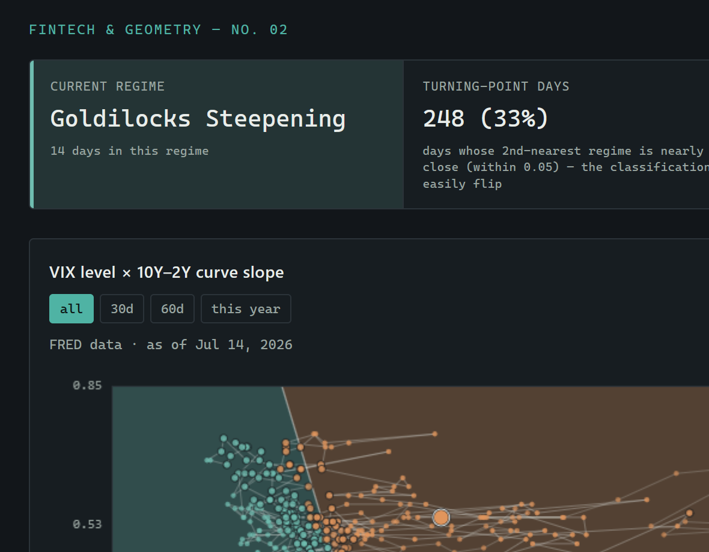

# Voronoi Fintech Explorations



**[Live demo →](https://patrickkeating-ca.github.io/voronoi/)**

Two self-contained, no-build-step HTML/JS pages that use Voronoi diagrams
(nearest-seed classification) as a visual/analytical device for fintech
ideas. `index.html` is a small landing page linking both; open it first,
or jump straight to either page below.

- **`voronoi-robo.html`** — robo-advisor model portfolio assignment. Six
  model portfolios are seed points in (risk tolerance, time horizon) space;
  320 synthetic clients are classified to the nearest one. A "market regime
  overlay" selector shifts every portfolio's risk coordinate at once (based
  on today's real market regime, or a chosen counterfactual) and reports how
  many clients get reassigned without answering a single new question.
- **`voronoi-regime.html`** — market regime classification over VIX × 10Y-2Y
  yield curve slope. Six regimes are seeds; each trading day is classified
  to the nearest one. Uses real FRED data when available
  (`data/regime-data.js`), with a synthetic fallback otherwise. Seeds are
  draggable, live-recomputing cells and reclassification.

Both pages render Voronoi cells as true polygons via `d3.Delaunay`/`voronoi()`
(vendored locally in `vendor/d3.min.js` — not from a CDN). There is no
npm/package.json; Node is only used for the data-fetching and backtesting
scripts in `scripts/`.

## Layout

```
index.html                landing page linking the two explorations below
voronoi-robo.html      \  the two pages themselves, at repo root so
voronoi-regime.html    /  file:// double-click still works
vendor/d3.min.js          vendored d3-delaunay build
scripts/fetch-data.js     FRED data puller (writes into data/)
scripts/backtest.js       classifier backtest, reads data/backtest-data.json
data/                     gitignored, regenerable output of fetch-data.js
assets/                   README images
docs/BACKTEST.md          backtest findings / known limitations
serve.ps1                 gitignored local-only helper, see below
```

## Quick start

Just open `voronoi-robo.html` or `voronoi-regime.html` directly in a
browser (double-click, or `file://` path) — both work with no server and
no build step.

To see real market data instead of the synthetic fallback, fetch it first
(see below).

## Fetching real data

```
node --env-file=.env scripts/fetch-data.js                    # fetch 3yr FRED data -> data/regime-data.{json,js}
node --env-file=.env scripts/fetch-data.js 8 backtest-data     # fetch 8yr data -> data/backtest-data.{json,js}
node scripts/backtest.js                                       # run classifier vs. data/backtest-data.json, print findings
```

Requires:

- Node 20.6+ (for `--env-file`)
- A FRED API key in `.env` at the repo root — copy `.env.example` to `.env`
  and fill in `FRED_API_KEY=` (get a free key at
  https://fred.stlouisfed.org/docs/api/api_key.html)

`scripts/fetch-data.js` takes optional `[yearsBack] [outBasename]` args so a
longer historical pull (for backtesting) doesn't clobber the live map's
3-year `regime-data.json`/`.js`.

## Running a local server (`serve.ps1`)

Not required — the pages load their data via `<script src="...">` tags,
which works fine directly from `file://`. `serve.ps1` is a local-only,
gitignored convenience script for the (currently unused) case of a real
`fetch()` call being added later, or for testing from another device on the
LAN. It spins up `npx serve` on a local port and opens the page in your
default browser.

```powershell
.\serve.ps1                                   # serves voronoi-regime.html on http://localhost:5173
.\serve.ps1 -Port 8080 -Page voronoi-robo.html  # custom port and page
```

Parameters:

- `-Port` (default `5173`) — port for the local static server
- `-Page` (default `voronoi-regime.html`) — which HTML file to open once the
  server is up

The script starts `npx serve` in a separate PowerShell window, polls
`http://localhost:<Port>` until it responds (up to 10s), then opens
`http://localhost:<Port>/<Page>` in your default browser. Close the spawned
server window to stop it.

## Data pipeline notes

- `scripts/fetch-data.js` pulls FRED series `T10Y2Y` (10Y-2Y curve slope)
  and `VIXCLS` (VIX), inner-joins them by date, and writes both a `.json`
  and a `.js` (`window.REGIME_DATA = {...}`) version — the `.js` version is
  what the pages actually load.
- `data/` is gitignored; it's fully regenerable from `scripts/fetch-data.js`
  and an API key, never hand-edited.
- `voronoi-regime.html`'s regime seeds (VIX/slope coordinates + labels) were
  calibrated by hand against the *3-year* window, checking that all 6 seeds
  get non-empty populations. `scripts/backtest.js` deliberately duplicates
  the same seed/domain constants rather than importing them, so it can test
  the *exact* live classifier against a separate 8-year pull without
  touching the live map.
- **Known limitation** (documented in `docs/BACKTEST.md`, from backtesting
  against 2018-2026 data): seed placement fit to a 3-year window doesn't
  generalize to longer history — e.g. it misses the real, shallow 2019
  yield-curve inversion, and collapses very different volatility spikes
  (VIX 35 vs. 82) into the same "Shock Selloff" label.

## Cross-file coupling

`voronoi-robo.html` duplicates `voronoi-regime.html`'s `REGIME_SEEDS` array,
domain constants, and nearest-seed distance function verbatim, in order to
independently compute "today's real regime" (for the default overlay
selection) from the same `data/regime-data.js` file. There is no shared
module — if the regime seeds/domain in `voronoi-regime.html` are changed,
the duplicated copy inside `voronoi-robo.html`'s `<script>` must be updated
to match, or the two pages' idea of "today's regime" will diverge silently.

See `CLAUDE.md` for more implementation details (theming system, sanity
checks, etc.) intended for whoever (human or AI) is editing this code.
